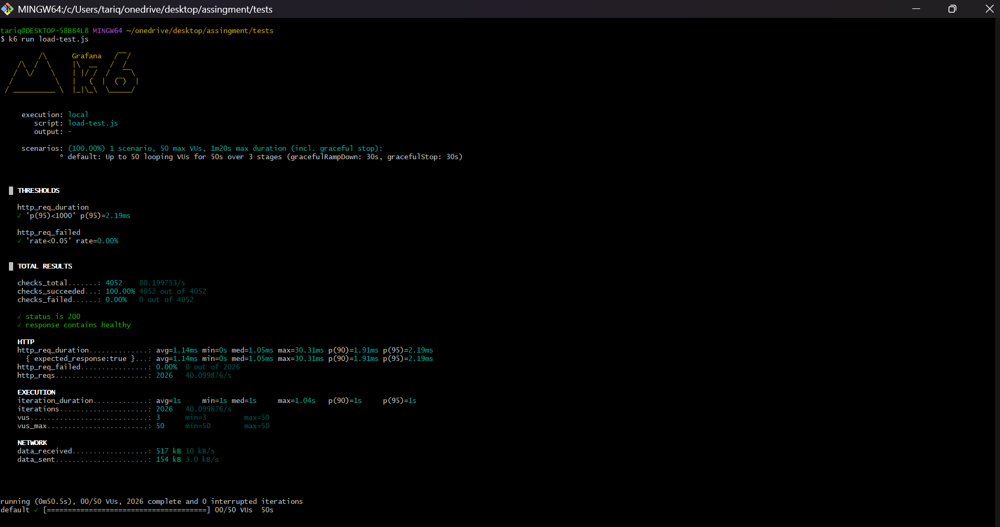
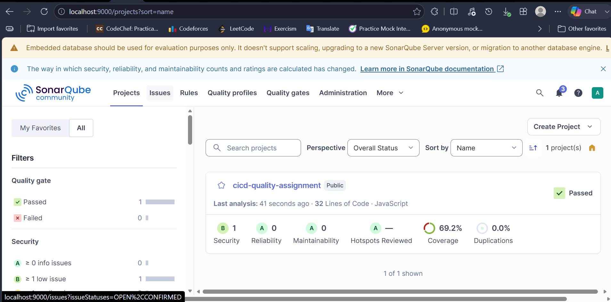
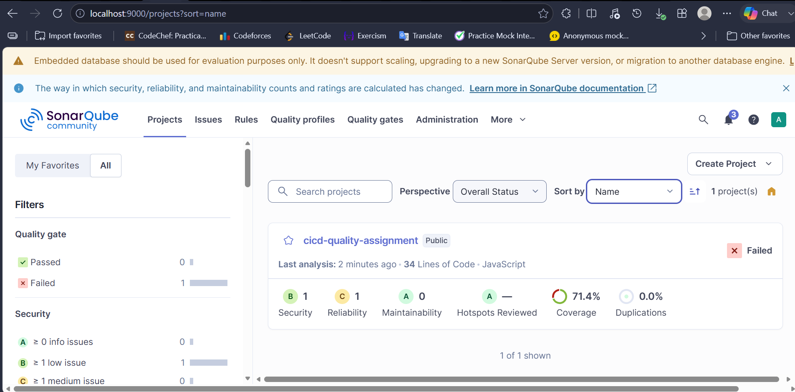
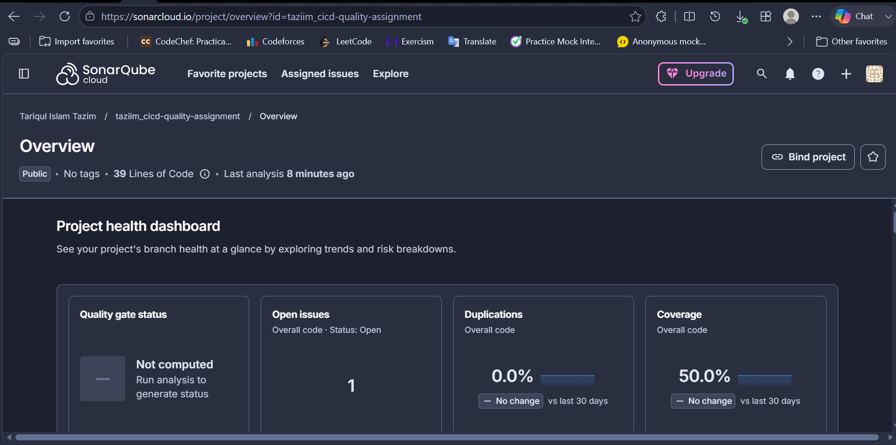
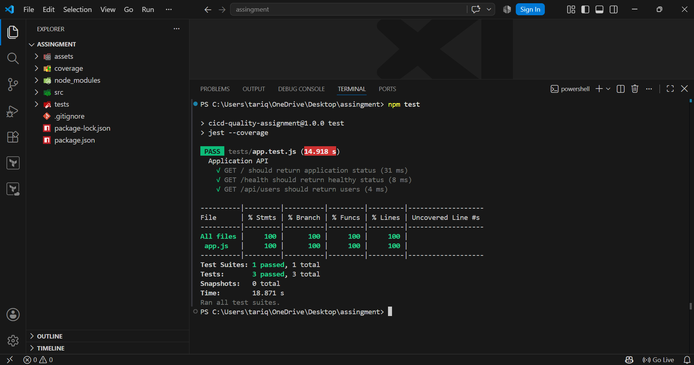
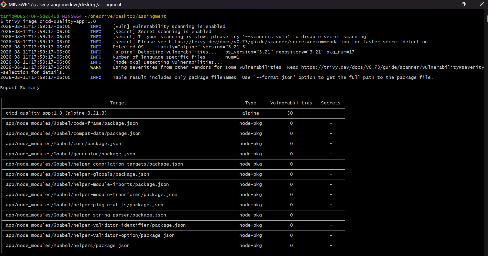
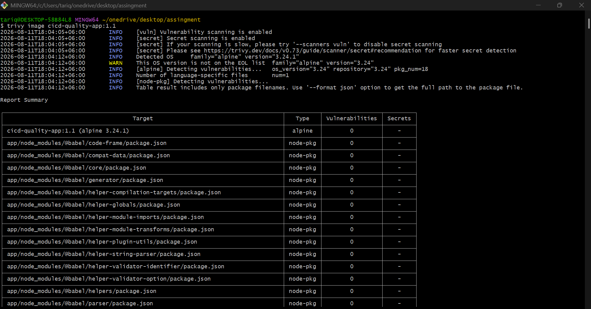

# Improving Quality, Security & Performance in CI/CD Pipelines
## Project Overview
This project demonstrates how testing, code quality analysis, security scanning, performance testing, secrets management, and policy as code can be integrated into a CI/CD pipeline.
The application is a simple Node.js and Express REST API.
## Technologies Used
* Node.js
* Express.js
* Jest
* Supertest
* SonarQube
* k6
* Trivy
* Docker
* Open Policy Agent (OPA)
* GitHub Actions
* GitHub Secrets
---
# Project Structure
```text
.
├── .github/workflows/ci.yml
├── src/
│   ├── app.js
│   └── server.js
├── tests/
│   └── app.test.js
├── load-test/
│   └── load-test.js
├── policy/
│   ├── docker.rego
│   └── input.json
├── docs/
├── screenshots/
├── Dockerfile
├── .dockerignore
├── .env.example
├── .gitignore
├── package.json
└── sonar-project.properties
```
---
# Part 1: Unit Testing & Code Quality
## Jest Unit Testing
Jest and Supertest were used to test the Express application.
The following endpoints were tested:
* `GET /`
* `GET /health`
* `GET /api/users`
Tests can be executed using:
```bash
npm install
npm test
```
The test execution is also integrated into the GitHub Actions pipeline.
## Install SonarQube Locally Using Docker
```bash
docker run -d \
  --name sonarqube \
  -p 9000:9000 \
  sonarqube:community
```
## SonarQube
SonarQube was used to analyze:
* Code quality
* Bugs
* Code smells
* Vulnerabilities
* Test coverage
Two issues identified during the initial analysis were fixed.
The following screenshots show the analysis before and after the fixes:
* `screenshots/sonar-before.png`
* `screenshots/sonar-after.png`
---
# Part 2: Load Testing
k6 was used for basic load testing.
The test simulates 50 virtual users and measures:
* Request response time
* Failed requests
* HTTP request duration
* P95 response time
The test can be executed using:
```bash
k6 run load-test.js
```
The actual test results are documented in:
```text
k6-results.md
```
---
# Part 3: Security Scanning
Trivy was used to scan the Docker image.
Example:
```bash
docker build -t cicd-quality-app:1.0 .
trivy image cicd-quality-app:1.0
```
The vulnerabilities discovered during the initial scan were reviewed and either fixed or documented with mitigation steps.
The security report is available in:
```text
security-report.md
```
---
# Part 4: Secrets Management
Hardcoded secrets were avoided.
Application configuration is read from environment variables.
For example:
```javascript
const apiKey = process.env.API_KEY;
const databaseUrl = process.env.DATABASE_URL;
```
Actual secrets are not stored in the source code or Git repository.
Local development uses environment variables, while CI/CD secrets can be stored using GitHub Actions Secrets.
The `.env` file is excluded from Git using `.gitignore`.
A `.env.example` file is provided to show the required environment variables without exposing actual secret values.
---
# Part 5: Policy as Code
Open Policy Agent (OPA) was used to implement a basic Docker image policy.
The policy prevents the use of the `latest` Docker tag.
For example:
```text
cicd-quality-app:latest
```
is rejected.
A versioned tag such as:
```text
cicd-quality-app:1.0
```
is allowed.
The policy is defined in:
```text
policy/docker.rego
```
The policy can be tested in policy check pipeline :
---

# CI/CD Pipeline
The GitHub Actions workflow performs the following tasks:
1. Checkout source code
2. Install Node.js dependencies
3. Run Jest tests
4. Run security scanning using Trivy
5. Validate OPA policy
The pipeline is configured in:
```text
.github/workflows/ci-cd.yml
.github/workflows/policy-check.yml
.github/workflows/trivy.yml
```
---
# Key Learnings
## 1. Automated Testing
Unit tests help detect application problems before deployment.
## 2. Code Quality
SonarQube helps identify bugs, code smells, vulnerabilities, and quality issues.
## 3. Performance Testing
k6 makes it possible to test application behavior under concurrent users.
## 4. Security
Trivy can identify vulnerabilities in Docker images and dependencies.
## 5. Secrets Management
Secrets should never be hardcoded in application source code.
Environment variables and CI/CD secret stores provide safer ways to manage sensitive configuration.
## 6. Policy as Code
OPA allows security and operational rules to be automatically checked during CI/CD.
## 7. CI/CD Automation
Combining these tools makes quality, security, and performance validation part of the development workflow instead of relying only on manual testing.
---

## Screenshots








# Conclusion
The completed CI/CD pipeline integrates automated testing, code quality analysis, security scanning, performance validation, secrets management, and policy enforcement.
This approach improves software reliability and helps detect quality and security problems before the application is deployed.


